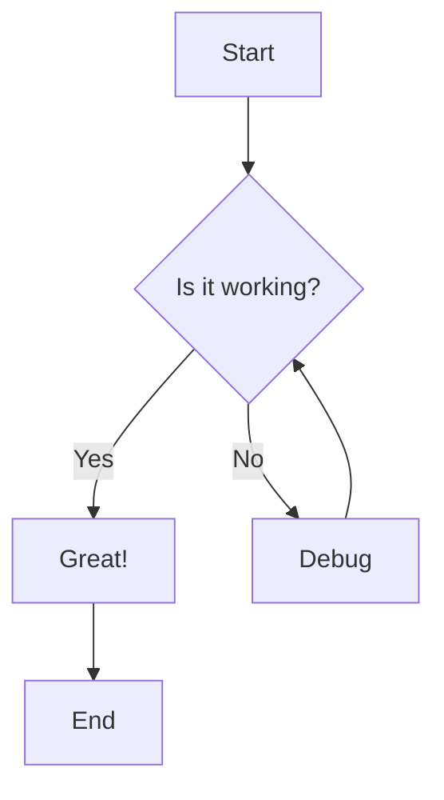
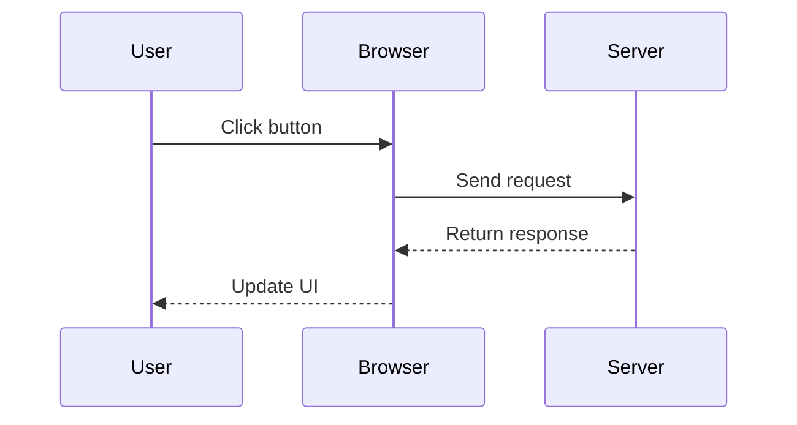
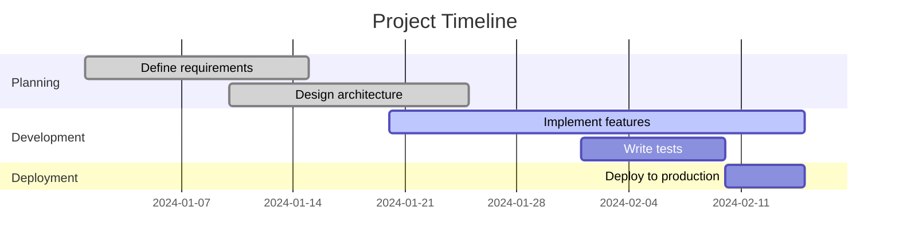
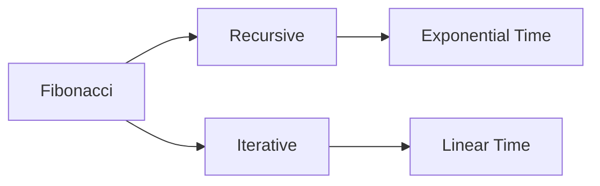

# Showcasing Advanced Markdown Features

Welcome to this comprehensive demonstration of the powerful markdown rendering capabilities now available on this blog! Thanks to ngx-markdown with all its plugins enabled, we can create rich, interactive content that goes far beyond basic text formatting.

## Syntax Highlighting with Prism.js

Code blocks now feature beautiful syntax highlighting, line numbers, and even copy-to-clipboard functionality. Here's a TypeScript example:

```typescript
interface User {
  id: number;
  name: string;
  email: string;
}

class UserService {
  private users: User[] = [];

  addUser(user: User): void {
    this.users.push(user);
  }

  getUserById(id: number): User | undefined {
    return this.users.find(user => user.id === id);
  }
}
```

And here's a C# example:

```csharp
using System;

public class User
{
    public int Id { get; set; }
    public string Name { get; set; }
    public string Email { get; set; }
}

public class UserService
{
    private List<User> users = new List<User>();

    public void AddUser(User user)
    {
        users.Add(user);
    }

    public User GetUserById(int id)
    {
        return users.Find(user => user.Id == id);
    }
}
```

And here's a CSS example:

```css
/* Basic CSS styling */
body {
  font-family: 'Arial', sans-serif;
  margin: 0;
  padding: 20px;
  background-color: #f5f5f5;
}

.container {
  max-width: 1200px;
  margin: 0 auto;
  background: white;
  border-radius: 8px;
  box-shadow: 0 2px 10px rgba(0, 0, 0, 0.1);
}

.button {
  background-color: #007bff;
  color: white;
  padding: 10px 20px;
  border: none;
  border-radius: 4px;
  cursor: pointer;
}

.button:hover {
  background-color: #0056b3;
}
```

Here's an SCSS example with variables and nesting:

```scss
// SCSS Variables and nesting
$primary-color: #007bff;
$secondary-color: #6c757d;
$border-radius: 4px;

.container {
  max-width: 1200px;
  margin: 0 auto;
  background: white;
  border-radius: $border-radius * 2;
  box-shadow: 0 2px 10px rgba(0, 0, 0, 0.1);

  .header {
    background-color: $primary-color;
    color: white;
    padding: 20px;
    border-radius: $border-radius * 2 $border-radius * 2 0 0;

    h1 {
      margin: 0;
      font-size: 2rem;
    }
  }

  .content {
    padding: 20px;

    .button {
      background-color: $primary-color;
      color: white;
      padding: 10px 20px;
      border: none;
      border-radius: $border-radius;
      cursor: pointer;
      transition: background-color 0.3s ease;

      &:hover {
        background-color: darken($primary-color, 10%);
      }

      &.secondary {
        background-color: $secondary-color;

        &:hover {
          background-color: darken($secondary-color, 10%);
        }
      }
    }
  }
}
```

Here's a LESS example with mixins:

```less
// LESS Mixins and variables
@primary-color: #007bff;
@secondary-color: #6c757d;
@border-radius: 4px;

// Mixin for buttons
.button-mixin(@bg-color, @text-color: white) {
  background-color: @bg-color;
  color: @text-color;
  padding: 10px 20px;
  border: none;
  border-radius: @border-radius;
  cursor: pointer;
  transition: background-color 0.3s ease;

  &:hover {
    background-color: darken(@bg-color, 10%);
  }
}

.container {
  max-width: 1200px;
  margin: 0 auto;
  background: white;
  border-radius: @border-radius * 2;
  box-shadow: 0 2px 10px rgba(0, 0, 0, 0.1);

  .header {
    background-color: @primary-color;
    color: white;
    padding: 20px;
    border-radius: @border-radius * 2 @border-radius * 2 0 0;

    h1 {
      margin: 0;
      font-size: 2rem;
    }
  }

  .content {
    padding: 20px;

    .primary-button {
      .button-mixin(@primary-color);
    }

    .secondary-button {
      .button-mixin(@secondary-color);
    }
  }
}
```

And here's a Python example:

```python
# Python example with classes and functions
class User:
    def __init__(self, user_id, name, email):
        self.user_id = user_id
        self.name = name
        self.email = email

    def __str__(self):
        return f"User(id={self.user_id}, name='{self.name}', email='{self.email}')"

class UserService:
    def __init__(self):
        self.users = []
        self.next_id = 1

    def add_user(self, name, email):
        user = User(self.next_id, name, email)
        self.users.append(user)
        self.next_id += 1
        return user

    def get_user_by_id(self, user_id):
        for user in self.users:
            if user.user_id == user_id:
                return user
        return None

    def get_all_users(self):
        return self.users.copy()

# Example usage
if __name__ == "__main__":
    service = UserService()
    
    # Add some users
    user1 = service.add_user("Alice Johnson", "alice@example.com")
    user2 = service.add_user("Bob Smith", "bob@example.com")
    
    print("All users:")
    for user in service.get_all_users():
        print(f"  {user}")
    
    # Find a specific user
    found_user = service.get_user_by_id(1)
    if found_user:
        print(f"\nFound user: {found_user}")
    else:
        print("\nUser not found")
```

And here's a Java example:

```java
public class User {
    private int id;
    private String name;
    private String email;

    public User(int id, String name, String email) {
        this.id = id;
        this.name = name;
        this.email = email;
    }

    public int getId() {
        return id;
    }

    public String getName() {
        return name;
    }

    public String getEmail() {
        return email;
    }

    @Override
    public String toString() {
        return "User{id=" + id + ", name='" + name + "', email='" + email + "'}";
    }
}

public class UserService {
    private List<User> users;
    private int nextId;

    public UserService() {
        this.users = new ArrayList<>();
        this.nextId = 1;
    }

    public User addUser(String name, String email) {
        User user = new User(nextId++, name, email);
        users.add(user);
        return user;
    }

    public User getUserById(int id) {
        for (User user : users) {
            if (user.getId() == id) {
                return user;
            }
        }
        return null;
    }

    public List<User> getAllUsers() {
        return new ArrayList<>(users);
    }
}

// Example usage
public class Main {
    public static void main(String[] args) {
        UserService service = new UserService();

        // Add users
        User user1 = service.addUser("Alice Johnson", "alice@example.com");
        User user2 = service.addUser("Bob Smith", "bob@example.com");

        // Display all users
        System.out.println("All users:");
        for (User user : service.getAllUsers()) {
            System.out.println("  " + user);
        }

        // Find specific user
        User foundUser = service.getUserById(1);
        if (foundUser != null) {
            System.out.println("\nFound user: " + foundUser);
        } else {
            System.out.println("\nUser not found");
        }
    }
}
```

Here's a JavaScript example:

```javascript
class User {
    constructor(id, name, email) {
        this.id = id;
        this.name = name;
        this.email = email;
    }

    toString() {
        return `User(id=${this.id}, name='${this.name}', email='${this.email}')`;
    }
}

class UserService {
    constructor() {
        this.users = [];
        this.nextId = 1;
    }

    addUser(name, email) {
        const user = new User(this.nextId++, name, email);
        this.users.push(user);
        return user;
    }

    getUserById(id) {
        return this.users.find(user => user.id === id);
    }

    getAllUsers() {
        return [...this.users];
    }
}

// Example usage
const service = new UserService();

// Add users
const user1 = service.addUser("Alice Johnson", "alice@example.com");
const user2 = service.addUser("Bob Smith", "bob@example.com");

// Display all users
console.log("All users:");
service.getAllUsers().forEach(user => {
    console.log(`  ${user}`);
});

// Find specific user
const foundUser = service.getUserById(1);
if (foundUser) {
    console.log(`\nFound user: ${foundUser}`);
} else {
    console.log("\nUser not found");
}
```

Here's a C example:

```c
#include <stdio.h>
#include <stdlib.h>
#include <string.h>

typedef struct {
    int id;
    char name[100];
    char email[100];
} User;

typedef struct {
    User* users;
    int count;
    int capacity;
    int nextId;
} UserService;

UserService* createUserService() {
    UserService* service = (UserService*)malloc(sizeof(UserService));
    service->users = (User*)malloc(10 * sizeof(User));
    service->count = 0;
    service->capacity = 10;
    service->nextId = 1;
    return service;
}

User* addUser(UserService* service, const char* name, const char* email) {
    if (service->count >= service->capacity) {
        service->capacity *= 2;
        service->users = (User*)realloc(service->users, service->capacity * sizeof(User));
    }

    User* user = &service->users[service->count++];
    user->id = service->nextId++;
    strcpy(user->name, name);
    strcpy(user->email, email);
    return user;
}

User* getUserById(UserService* service, int id) {
    for (int i = 0; i < service->count; i++) {
        if (service->users[i].id == id) {
            return &service->users[i];
        }
    }
    return NULL;
}

void printUser(User* user) {
    printf("User(id=%d, name='%s', email='%s')\n", user->id, user->name, user->email);
}

int main() {
    UserService* service = createUserService();

    // Add users
    User* user1 = addUser(service, "Alice Johnson", "alice@example.com");
    User* user2 = addUser(service, "Bob Smith", "bob@example.com");

    // Display all users
    printf("All users:\n");
    for (int i = 0; i < service->count; i++) {
        printf("  ");
        printUser(&service->users[i]);
    }

    // Find specific user
    User* foundUser = getUserById(service, 1);
    if (foundUser) {
        printf("\nFound user: ");
        printUser(foundUser);
    } else {
        printf("\nUser not found\n");
    }

    // Cleanup
    free(service->users);
    free(service);

    return 0;
}
```

And here's a C++ example:

```cpp
#include <iostream>
#include <vector>
#include <string>
#include <memory>

class User {
private:
    int id;
    std::string name;
    std::string email;

public:
    User(int id, const std::string& name, const std::string& email)
        : id(id), name(name), email(email) {}

    int getId() const { return id; }
    const std::string& getName() const { return name; }
    const std::string& getEmail() const { return email; }

    std::string toString() const {
        return "User(id=" + std::to_string(id) + ", name='" + name + "', email='" + email + "')";
    }
};

class UserService {
private:
    std::vector<std::unique_ptr<User>> users;
    int nextId;

public:
    UserService() : nextId(1) {}

    User* addUser(const std::string& name, const std::string& email) {
        auto user = std::make_unique<User>(nextId++, name, email);
        User* userPtr = user.get();
        users.push_back(std::move(user));
        return userPtr;
    }

    User* getUserById(int id) const {
        for (const auto& user : users) {
            if (user->getId() == id) {
                return user.get();
            }
        }
        return nullptr;
    }

    const std::vector<User*> getAllUsers() const {
        std::vector<User*> result;
        for (const auto& user : users) {
            result.push_back(user.get());
        }
        return result;
    }
};

int main() {
    UserService service;

    // Add users
    User* user1 = service.addUser("Alice Johnson", "alice@example.com");
    User* user2 = service.addUser("Bob Smith", "bob@example.com");

    // Display all users
    std::cout << "All users:" << std::endl;
    for (User* user : service.getAllUsers()) {
        std::cout << "  " << user->toString() << std::endl;
    }

    // Find specific user
    User* foundUser = service.getUserById(1);
    if (foundUser) {
        std::cout << "\nFound user: " << foundUser->toString() << std::endl;
    } else {
        std::cout << "\nUser not found" << std::endl;
    }

    return 0;
}
```

## Line Highlighting

You can highlight specific lines in code blocks using special comments. For example, let's highlight the error handling part:

```typescript
function processData(data: any) {
  try {
    // Validate input
    if (!data) {
      throw new Error('Data is required');
    }

    // Process the data
    const result = data.map(item => item.value * 2);

    return result;
  } catch (error) {
    // highlight-next-line
    console.error('Processing failed:', error.message);
    throw error;
  }
}
```

You can also highlight multiple lines:

```typescript
function validateUser(user) {
  // highlight-start
  if (!user.name) {
    throw new Error('Name is required');
  }
  if (!user.email) {
    throw new Error('Email is required');
  }
  // highlight-end
  
  return true;
}
```

## Command Line Examples

The command line plugin automatically adds prompts to terminal commands. By default, it shows `user@localhost:~$` but you can customize this:

### Default Command Line (with automatic prompt):

```bash
npm install ngx-markdown
npm run build
```

### Custom Prompt Example:

For custom prompts, you would specify properties on the markdown component, but since we enabled it globally, here's how it would work:

```bash
git clone https://github.com/jfcere/ngx-markdown.git
cd ngx-markdown
npm install
npm run build
```

### To Remove Prompts:

If you want plain code blocks without prompts, you can disable commandLine for specific sections or use different languages.

### Plain Code Block (no prompt):

```
npm install ngx-markdown
npm run build
```

**Note**: The `user@localhost:~$` prompt is added automatically by the Prism.js command-line plugin when `commandLine` is enabled globally.

### Alternative: Disable Command Line for Specific Blocks

If you want to avoid the automatic prompt for certain code blocks, you can use plain fenced code blocks without language specification:

```
npm install ngx-markdown
npm run build
```

Or use a different approach in your markdown component configuration.

### Customizing the Prompt

If you want to change the prompt from `user@localhost:~$`, you can modify the markdown component properties. For example, to use a different user/host:

```bash
# This would show as: chris@remotehost:~$ 
sudo apt update
sudo apt upgrade
```

**Note**: To actually customize the prompt, you would need to add `[user]="'chris'"` and `[host]="'remotehost'"` properties to the `<markdown>` component in your Angular template.

## Mathematical Expressions with KaTeX

Mathematics rendering is now supported! Here are some examples:

### Inline Math

The quadratic formula is $x = \frac{-b \pm \sqrt{b^2 - 4ac}}{2a}$.

### Display Math

Complex equations are beautifully rendered:

$$\int_{-\infty}^{\infty} e^{-x^2} dx = \sqrt{\pi}$$

$$\lim_{x \to 0} \frac{\sin(x)}{x} = 1$$

### Matrices and Systems

$$
\begin{pmatrix}
a & b \\
c & d
\end{pmatrix}
\begin{pmatrix}
x \\
y
\end{pmatrix}
=
\begin{pmatrix}
ax + by \\
cx + dy
\end{pmatrix}
$$

## Mermaid Diagrams

Diagrams and flowcharts are now possible! Here's a simple flowchart:



### Sequence Diagram



### Gantt Chart



## Emoji Support

Emojis are automatically converted from shortcodes! I :heart: ngx-markdown! It's :rocket: fast and :sparkles: beautiful.

Some more examples:
- :thumbs_up: Great job!
- :fire: This is hot!
- :100: Perfect score!

## Advanced Features

### Tables with Syntax Highlighting

| Language | Hello World |
|----------|-------------|
| Python | `print("Hello, World!")` |
| JavaScript | `console.log("Hello, World!")` |
| Java | `System.out.println("Hello, World!");` |
| C# | `Console.WriteLine("Hello, World!");` |
| CSS | `body { color: red; }` |
| SCSS | `$color: red; body { color: $color; }` |
| LESS | `@color: red; body { color: @color; }` |
| TypeScript | `console.log("Hello, World!");` |
| C | `printf("Hello, World!\n");` |
| C++ | `std::cout << "Hello, World!" << std::endl;` |
| Bash | `echo "Hello, World!"` |

### Mixed Content

You can combine all features in one post:

```javascript
function fibonacci(n) {
  if (n <= 1) return n;
  return fibonacci(n - 1) + fibonacci(n - 2);
}

// Calculate the 10th Fibonacci number
console.log(fibonacci(10)); // Output: 55
```

The Fibonacci sequence grows exponentially: $F_n = \frac{\phi^n - (-\phi)^{-n}}{\sqrt{5}}$ where $\phi = \frac{1 + \sqrt{5}}{2}$.



## Conclusion

This blog now supports:
- ✅ Syntax highlighting with line numbers
- ✅ Line highlighting for emphasis
- ✅ Command line formatting
- ✅ Mathematical expressions
- ✅ Interactive diagrams
- ✅ Emoji rendering
- ✅ Copy-to-clipboard functionality

Try copying any code block above - you'll see the copy button appear on hover! :clipboard:

Happy blogging! :wave:
