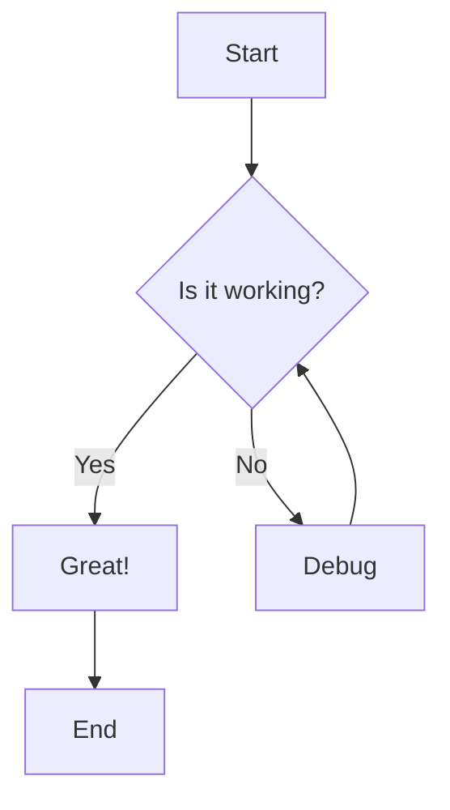
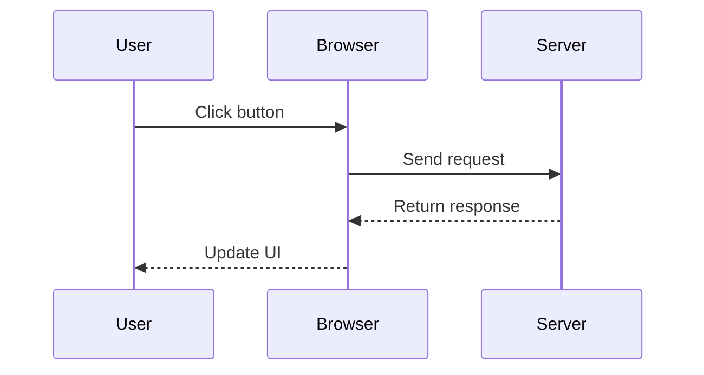
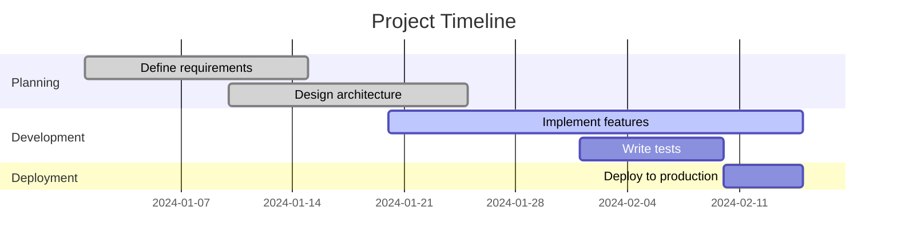
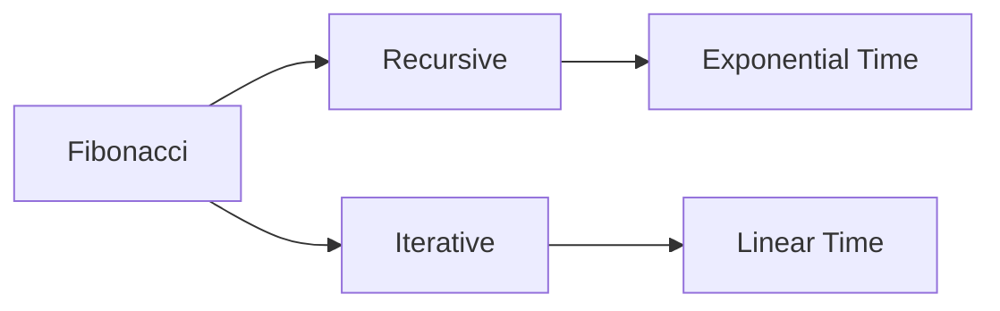

# Showcasing Advanced Markdown Features

Welcome to this comprehensive demonstration of the powerful markdown rendering capabilities now available on this blog! Thanks to ngx-markdown with all its plugins enabled, we can create rich, interactive content that goes far beyond basic text formatting.

## Syntax Highlighting with Prism.js

Code blocks now feature beautiful syntax highlighting, line numbers, and even copy-to-clipboard functionality. Here's a TypeScript example:

```typescript
interface User {
  id: number;
  name: string;
  email: string;
}

class UserService {
  private users: User[] = [];

  addUser(user: User): void {
    this.users.push(user);
  }

  getUserById(id: number): User | undefined {
    return this.users.find(user => user.id === id);
  }
}
```

## Line Highlighting

You can highlight specific lines in code blocks using special comments. For example, let's highlight the error handling part:

```typescript
function processData(data: any) {
  try {
    // Validate input
    if (!data) {
      throw new Error('Data is required');
    }

    // Process the data
    const result = data.map(item => item.value * 2);

    return result;
  } catch (error) {
    // highlight-next-line
    console.error('Processing failed:', error.message);
    throw error;
  }
}
```

You can also highlight multiple lines:

```typescript
function validateUser(user) {
  // highlight-start
  if (!user.name) {
    throw new Error('Name is required');
  }
  if (!user.email) {
    throw new Error('Email is required');
  }
  // highlight-end
  
  return true;
}
```

## Command Line Examples

The command line plugin automatically adds prompts to terminal commands. By default, it shows `user@localhost:~$` but you can customize this:

### Default Command Line (with automatic prompt):

```bash
npm install ngx-markdown
npm run build
```

### Custom Prompt Example:

For custom prompts, you would specify properties on the markdown component, but since we enabled it globally, here's how it would work:

```bash
git clone https://github.com/jfcere/ngx-markdown.git
cd ngx-markdown
npm install
npm run build
```

### To Remove Prompts:

If you want plain code blocks without prompts, you can disable commandLine for specific sections or use different languages.

### Plain Code Block (no prompt):

```
npm install ngx-markdown
npm run build
```

**Note**: The `user@localhost:~$` prompt is added automatically by the Prism.js command-line plugin when `commandLine` is enabled globally.

### Alternative: Disable Command Line for Specific Blocks

If you want to avoid the automatic prompt for certain code blocks, you can use plain fenced code blocks without language specification:

```
npm install ngx-markdown
npm run build
```

Or use a different approach in your markdown component configuration.

### Customizing the Prompt

If you want to change the prompt from `user@localhost:~$`, you can modify the markdown component properties. For example, to use a different user/host:

```bash
# This would show as: chris@remotehost:~$ 
sudo apt update
sudo apt upgrade
```

**Note**: To actually customize the prompt, you would need to add `[user]="'chris'"` and `[host]="'remotehost'"` properties to the `<markdown>` component in your Angular template.

## Mathematical Expressions with KaTeX

Mathematics rendering is now supported! Here are some examples:

### Inline Math

The quadratic formula is $x = \frac{-b \pm \sqrt{b^2 - 4ac}}{2a}$.

### Display Math

Complex equations are beautifully rendered:

$$\int_{-\infty}^{\infty} e^{-x^2} dx = \sqrt{\pi}$$

$$\lim_{x \to 0} \frac{\sin(x)}{x} = 1$$

### Matrices and Systems

$$
\begin{pmatrix}
a & b \\
c & d
\end{pmatrix}
\begin{pmatrix}
x \\
y
\end{pmatrix}
=
\begin{pmatrix}
ax + by \\
cx + dy
\end{pmatrix}
$$

## Mermaid Diagrams

Diagrams and flowcharts are now possible! Here's a simple flowchart:



### Sequence Diagram



### Gantt Chart



## Emoji Support

Emojis are automatically converted from shortcodes! I :heart: ngx-markdown! It's :rocket: fast and :sparkles: beautiful.

Some more examples:
- :thumbs_up: Great job!
- :fire: This is hot!
- :100: Perfect score!

## Advanced Features

### Tables with Syntax Highlighting

| Language | Hello World |
|----------|-------------|
| Python | `print("Hello, World!")` |
| JavaScript | `console.log("Hello, World!")` |
| Java | `System.out.println("Hello, World!");` |

### Mixed Content

You can combine all features in one post:

```javascript
function fibonacci(n) {
  if (n <= 1) return n;
  return fibonacci(n - 1) + fibonacci(n - 2);
}

// Calculate the 10th Fibonacci number
console.log(fibonacci(10)); // Output: 55
```

The Fibonacci sequence grows exponentially: $F_n = \frac{\phi^n - (-\phi)^{-n}}{\sqrt{5}}$ where $\phi = \frac{1 + \sqrt{5}}{2}$.



## Conclusion

This blog now supports:
- ✅ Syntax highlighting with line numbers
- ✅ Line highlighting for emphasis
- ✅ Command line formatting
- ✅ Mathematical expressions
- ✅ Interactive diagrams
- ✅ Emoji rendering
- ✅ Copy-to-clipboard functionality

Try copying any code block above - you'll see the copy button appear on hover! :clipboard:

Happy blogging! :wave:
